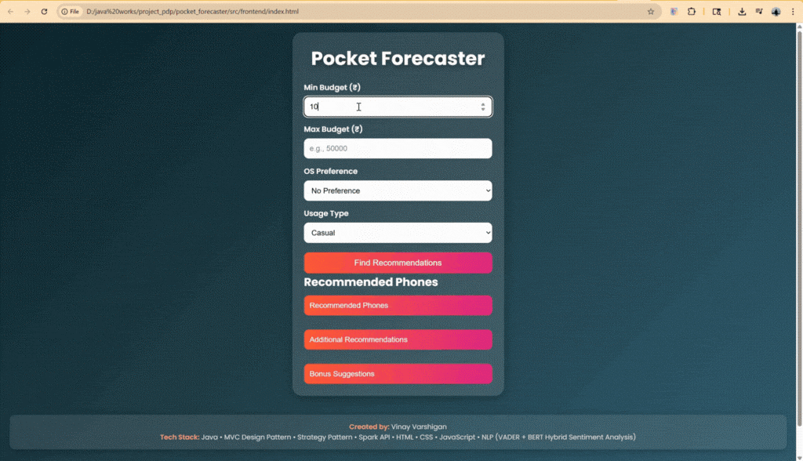

# 📱 Pocket Forecaster

### *An AI-Powered Smartphone Recommendation System*

**Status:** Project Completed — **Deployment Soon 🚀**

---

##  Overview

**Pocket Forecaster** is an AI-powered smartphone recommendation engine that suggests the best mobile phones based on **budget**, **usage type**, and **operating system**.
Built using **Java**, **MVC architecture**, **Strategy Design Pattern**, and a hybrid sentiment analysis model (**VADER + BERT**), it helps users confidently choose the right smartphone backed by real customer insights.

Whether users are gamers, photographers, or casual users, Pocket Forecaster delivers tailored recommendations and personalized add-ons.

---

## 🗂️ Project Structure

```
pocket_forecaster/
│
├─ src/
├─ Test/
├─ target/                          ← ignored by .gitignore
├─ .idea/                           ← ignored by .gitignore
│
├─ documentation/
│     └─ Pocket_forecaster_final_document.pdf
│
├─ Sent_analysis_for_reviews_hybrid.ipynb
├─ pom.xml
├─ README.md
├─ demo.mp4
└─ .gitignore
```

---

##  Key Features

### 1️⃣ Smart Filtering Engine

Filters phones based on:

* **Budget**
* **Usage Type** (Gaming, Photography, Casual, Performance, etc.)
* **OS Preference** (Android / iOS)

### 2️⃣ Hybrid Sentiment Analysis (VADER + BERT)

* Analyzes real customer reviews
* Produces sentiment % (e.g., *89% Positive*)
* Generates a one-line AI summary

### 3️⃣ Personalized Add-ons

Recommends:

* Accessories
* Apps
* Games
  based on user usage type.

### 4️⃣ Batch Navigation

If users want more options, the system loads the **next batch**, including premium devices.

### 5️⃣ Clean & Modular Architecture

* MVC Architecture
* Strategy Design Pattern
* Strong OOP implementation
* JUnit test cases included

### 6️⃣ Responsive Web Frontend

* Built using **HTML, CSS, JavaScript**
* Clean and user-friendly interface

---

## ⚙️ Tech Stack

### **Backend**

* Java
* MVC Pattern
* Strategy Pattern
* Spark Java API
* Apache Commons CSV

### **Frontend**

* HTML
* CSS
* JavaScript

### **AI / NLP**

* Python (VADER & BERT)
* Jupyter Notebook

### **Data**

* Real-world smartphone datasets (CSV files)
* Includes specs, reviews, sentiment scores, and add-ons

---

## 🔄 System Workflow

```
1. Load CSV datasets (specs, reviews, sentiment, add-ons)
2. User provides:
      → Budget
      → Usage Type
      → OS Preference
3. Java Filtering Engine applies:
      → Strategy Pattern (usage logic)
      → Budget filtering
      → OS priority
4. Sentiment analysis (hybrid: VADER + BERT) is attached
5. Top 3 smartphones displayed with:
      → Sentiment %
      → One-line summary
      → Buy Link
6. Personalized Add-ons shown
7. "Next Batch" option to load more phones
```

---

## 📸 Example Output

**Input:**

* Budget: ₹80,000
* Usage: Gaming
* OS: Android

**Recommendation Output:**
1️⃣ **ASUS ROG Phone 8 – ₹74,999**

* Sentiment: **89% Positive**
* “Built for heavy gaming.”
* Buy Link Available

2️⃣ **OnePlus 12 – ₹59,999**

* Sentiment: **84% Positive**

3️⃣ **Samsung Galaxy S23 – ₹69,999**

* Sentiment: **90% Positive**

**Gaming Add-ons:**

* Razer Kishi Game Controller
* Black Shark Cooling Fan
* JBL Quantum Earbuds
* COD Mobile / Asphalt 9 / PUBG New State

---
## 🎬 Demo Preview

### 🎞 GIF Preview  


### 📥 Full Video  
[▶ Click here to watch or download the full demo video](https://raw.githubusercontent.com/macrosensor2022/pocket_forecaster/main/demo.mp4)

---

## 📄 Full Documentation

The complete project documentation is available here:

👉 **[Pocket Forecaster – Final Documentation (PDF)](documentation/Pocket_forecaster_final_document.pdf)**

This document includes:

* Abstract
* System Architecture
* Design Patterns
* AI Pipeline
* Use Cases
* Screenshots
* Future Work

---

## 📅 Project Timeline

| Date Range | Milestone                                     |
| ---------- | --------------------------------------------- |
| Oct 20–30  | Core Java logic & tests                       |
| Nov 1–10   | UI development, CSV integration, AI sentiment |
| Nov 11–20  | Add-ons + Batch navigation                    |
| Nov 21–30  | Polishing, testing, Javadoc                   |
| Dec 1–3    | Final Demo                                    |

---

## 🚀 Future Enhancements

* Real-time pricing via API
* User login + saved preferences
* ML-based scoring model
* Transformer-based sentiment (RoBERTa, GPT)
* ML-driven add-on recommendations
* Country-wise pricing support
* Modern UI redesign with dark mode
* Hybrid recommendation engine
* **Cloud Deployment (AWS/Azure) coming soon** ☁️

---

## ⭐ Support

If you like this project, please ⭐ the repository!
It motivates future improvements.

---

## 👤 Author

**Vinay Varshigan SJ**
MS in Computer Science – Northeastern University
AI & ML Enthusiast | Cloud | NLP | Computer Vision
